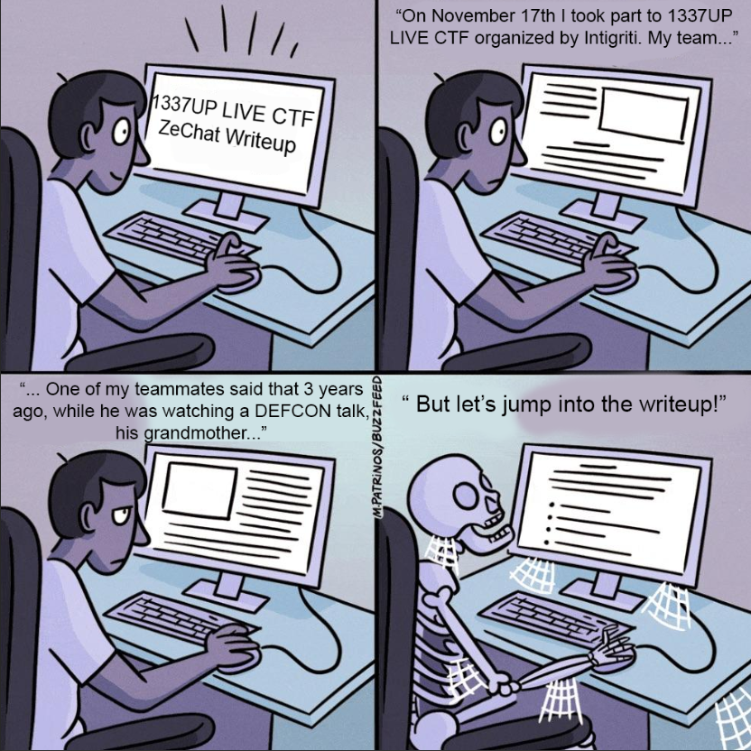
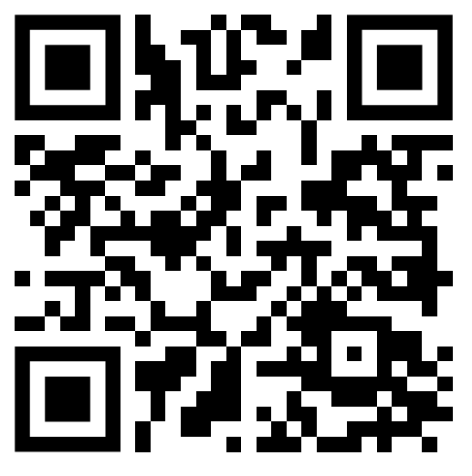
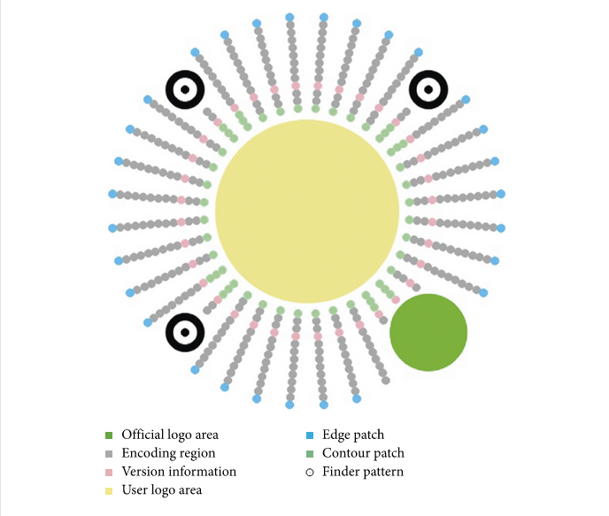
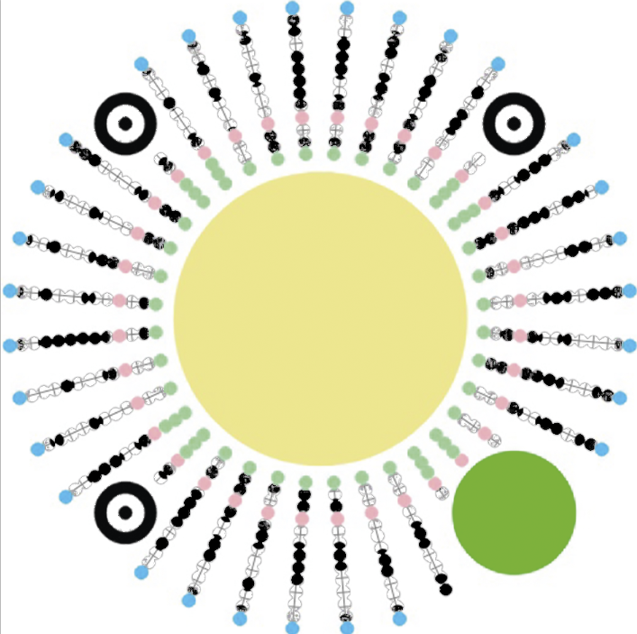
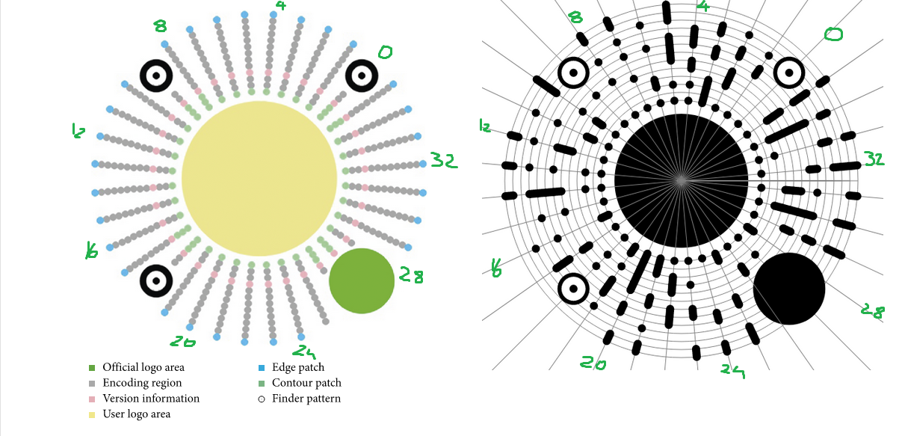

## Disclaimer:
Once the CTF was over, I found out in the Intigriti Discord server that this challenge was quite similar to the Intigriti challenge coin from DefCon and BSides Las Vegas. You can find the writeup by chivato [here](https://hackmd.io/@Chivato/SkN3Piyan).
It could have saved me some time but I did not know about that, so I had to do all my research from scratch. Nevertheless, I still managed to get first blood on the challenge.
# Writeup




We are only given the following PNG image


### Part 1: trying some stego

First thing first, we run `exiftool` to see if we can get some more information in the image metadata, but nothing useful shows up.

We can also try to upload the image on [aperisolve](https://www.aperisolve.com) to quickly check if there was some steganography involved, but this also does not help.

Let's put the steganography aside for the moment and start to try and figure out what the image could be.

###  Part 2: *You scan me right round, baby, right round* 🎶

The three circles on the top and on the bottom left kinda resemble the three square patterns that one can find in QR codes. These patterns are used to help the decoding software align the image correctly.




By Googling "round qr code" we find some different examples of round 2D matrix bar code, such as the ones used by Facebook Messenger and the ones used by Kik.
The [Wikipedia page for Barcode](https://en.wikipedia.org/wiki/Barcode#Matrix_(2D)_barcodes) also has a list of 2D barcodes, including Apple-proprietary App Clip Code and ShotCode, but none of them matches our images.

If wee keep scrolling the Google Images results we finally stumble upon this image here

![[qrcode.13a824c1.png]]

and the code family on the left actually matches ours. This image belongs to the [developers documentation pages by Weixin](https://developers.weixin.qq.com/minigame/en/dev/tutorial/open-ability/qrcode.html).

It turns out that Weixin is just the original Chinese name for the app WeChat. That sounds promising, since that's quite similar to the name of the challenge.

If we keep reading the documentation page, we see that what we have in our hands is a so-called "Mini program". Mini programs are like small sub-applications that belong to the WeChat ecosystem. They allow the user to extend WeChat functionalities and add features (such as eCommerce etc.) without the need to exit the app.

Sadly, the Mini program technology appears to be proprietary (correct me if I'm wrong) and there are no decoders available online. We have to keep researching to find a way to decode it.

One of the first results that we get for "mini program qr code" is a 2021 scientific paper by Chen et al. titled ["**Data Hiding Based on Mini Program Code**"](https://www.hindawi.com/journals/scn/2021/5546344/) .

Skimming through the paper, we get more information about the mini programs:

> There are three different versions of mini program codes: 36 rays, 54 rays, and 72 rays, named V-36, V-54, and V-72, respectively.

Ours is a V-36.

The most important info that we can get from the paper is the following scheme that shows the structure of the Mini Program:




We are interested in the "Encoding region" marked in grey.

My first idea to quickly obtain the encoding region from the challenge image was to open both images in a photo editing program and then visually mask out everything that does not belong to it.
This idea sadly didn't work because of some offset discrepancy between the two.

You can see my poor attempt in the pic below




### Part 3: The highly sophisticated image decoding method that makes use of a really niche program

This led me to use a **highly sophisticated image decoding method that makes use of a really niche program**:

I opened both images on MS Paint and typed out the bits by hand.



Now, I could have written some script that would allow me to retrieve the bit values from the image and decode the miniprogram. But that would have probably taken hours. Don't get me wrong, I probably would have done that if I had not 1 but 100s of mini programs to decode.
But that wasn't the case and it really wouldn't have been worth it for just one single image.

Relevant xkcd:


The 0 index in the 45 degree ray and the direction were taken from the paper (spoiler: they were wrong, but that doesn't really matter too much):

> We start from the ray between the center of the user logo area and the center of the finder pattern in the upper right corner and then number of the rays counterclockwise.

In a couple of minutes I was able to obtain the entire bit stream

```python
bitstream = ["01",
"0101000111",
"0100010010",
"0011100101",
"0100100101",
"0101111101",
"0001001000",
"1000010010",
"11011100",
"01",
"1001110100",
"1111011001",
"1101100101",
"0110111000",
"0000110001",
"0000011001",
"1000110011",
"1",
"",
"100",
"0011011011",
"0111110011",
"0011010001",
"0000110111",
"0100001101",
"0111110110",
"11011101",
"00",
"0000110100",
"0011011010",
"1100110110",
"0111011100",
"0101111011",
"0100010010",
"0010010101",
"01001001"]
```

And if we join all the strings and decode from binary, we finally get

<center><b>TtHåIWÑ"ÜgOgenf3Ãmó4Ct5öÝCk6w´H•I</b></center>

which... doesn't really look like a flag.

At this point I must admit I was a bit disappointed, since I thought I had done everything I was supposed to.

I decided to bruteforce all starting points in the list, in both directions (which is definitely feasible, there's only 72 possibilities)

```python
bitstream = ["01",
# ...snip...
"01001001"]

def rotate(l: list, n: int) -> list:
    return l[n:] + l[:n]

for b in [False, True]:
    if b:
        bitstream = bitstream[::-1]
    for i in range(len(bitstream)):
        rotated = rotate(bitstream, i)
        try:
            s = bytes.fromhex(str(hex(int("".join(rotated), 2))[2:])).decode("utf-8")
            if True:
                print(s)
        except ValueError as e:
            continue
```

Which outputs

```
w3ch47_d474_3nc0d1n6_ftw!!!}INTIGRITI{
7_d474_3nc0d1n6_ftw!!!}INTIGRITI{w3ch4
4_3nc0d1n6_ftw!!!}INTIGRITI{w3ch47_d47
n6_ftw!!!}INTIGRITI{w3ch47_d474_3nc0d1
w!!!}INTIGRITI{w3ch47_d474_3nc0d1n6_ft
INTIGRITI{w3ch47_d474_3nc0d1n6_ftw!!!}
RITI{w3ch47_d474_3nc0d1n6_ftw!!!}INTIG
```

Flag: `INTIGRITI{w3ch47_d474_3nc0d1n6_ftw!!!}`