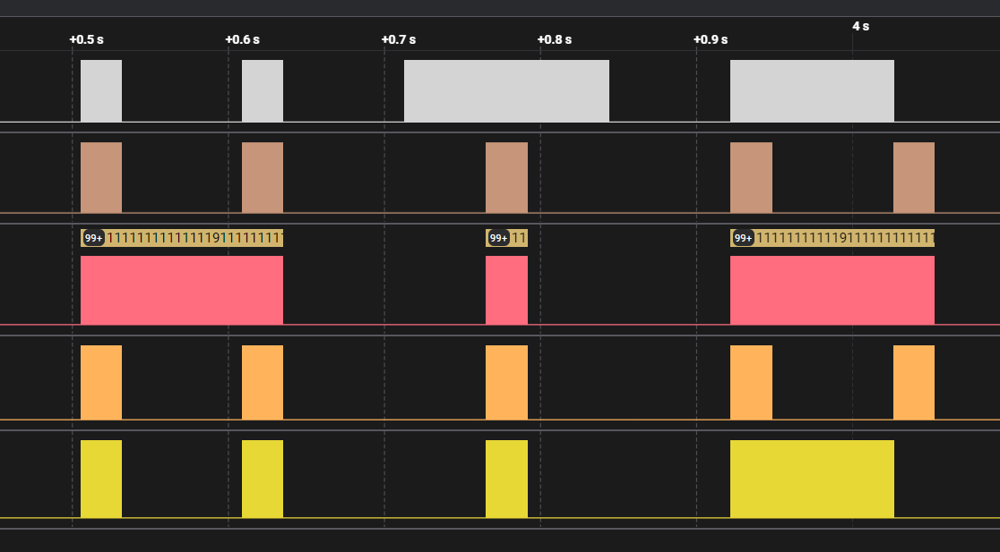

# Timed Transmission

*As part of your initialization sequence, your team loaded various tools into your system, but you still need to learn how to use them effectively. They have tasked you with the challenge of finding the appropriate tool to open a file containing strange serial signals. Can you rise to the challenge and find the right tool?*
___

We are given a .sal file containing some serial data recorded on 5 different channels.

The challenge is actually much simpler than one could think and can be easily overthought.

There's no bitrate or endianness to find, it's just a matter of opening the signal with a program like Logic, and looking at the shape of the entire thing:

